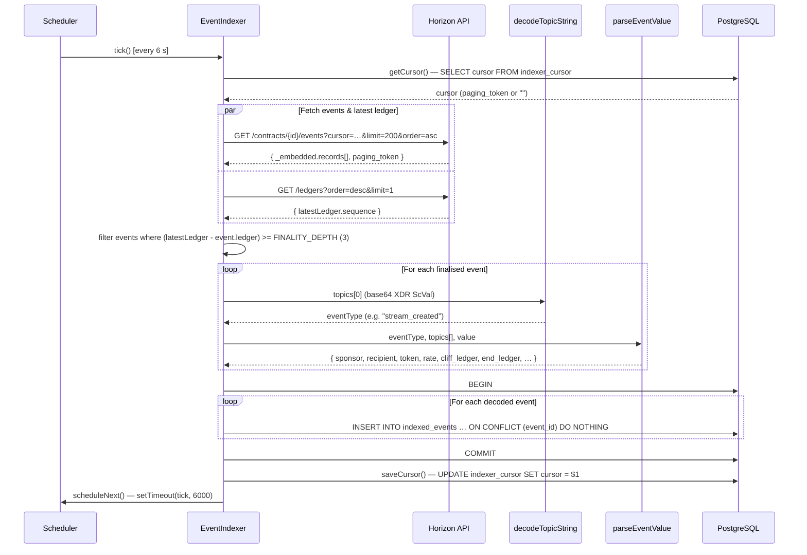
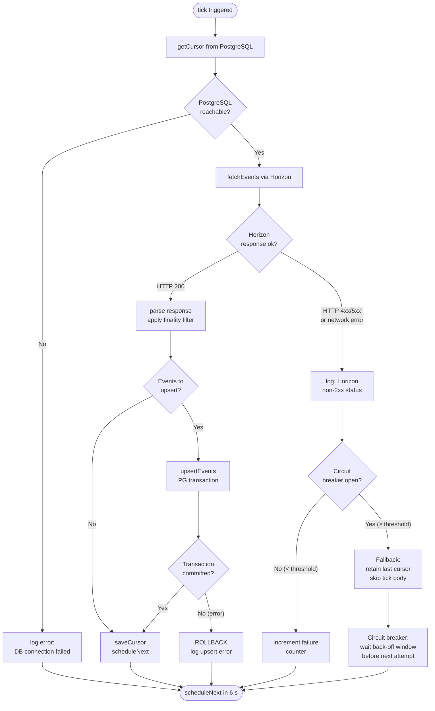
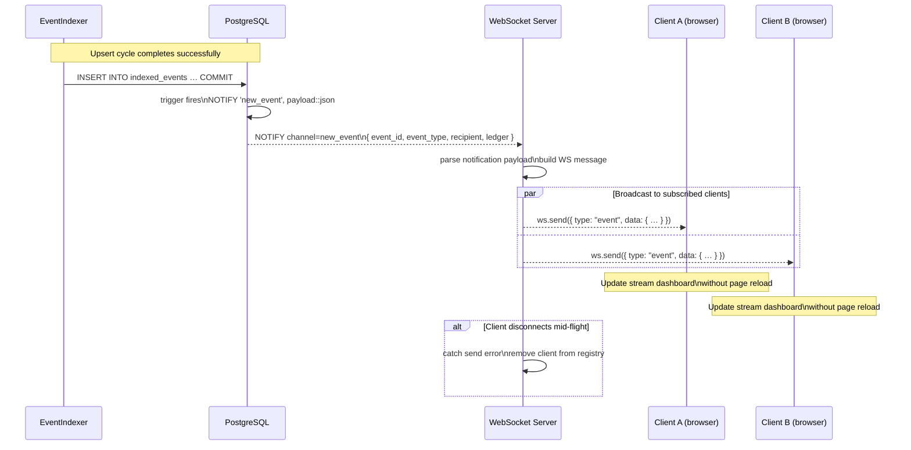

# Architecture

This document describes the high-level system architecture of the vesting-cliff-drip-stream platform and provides detailed diagrams for the event indexer pipeline.

---

## System Overview

The platform consists of four main layers:

| Layer | Components |
|-------|------------|
| **On-chain** | Soroban smart contract (`vesting_cliff_drip_stream`) deployed on Stellar |
| **Indexer** | `EventIndexer` — Node.js service polling Horizon and writing to PostgreSQL |
| **API** | REST/WebSocket server exposing indexed data to consumers |
| **Frontend** | Web UI receiving real-time stream updates via WebSocket |

---

## Event Indexer Pipeline

The `EventIndexer` class (in `backend/src/indexer.ts`) is responsible for bridging on-chain contract events with the off-chain PostgreSQL database. The diagrams below describe each stage of that pipeline.

---

### 1. Sequence Diagram — Horizon Polling → Event Parsing → DB Upsert

This diagram shows the `tick()` cycle that runs every 6 seconds (`POLL_INTERVAL_MS`). The indexer reads its last cursor, fetches a page of up to 200 events from Horizon, applies a 3-ledger finality guard (`FINALITY_DEPTH`), decodes each event topic and value, then upserts into PostgreSQL inside a single transaction.

---

### 2. Data Flow — Soroban Contract → Horizon → Indexer → PostgreSQL → API → Frontend

This end-to-end diagram traces an event from the moment a transaction is submitted on Stellar to when it appears in the frontend UI.

```mermaid
flowchart LR
    subgraph Stellar["Stellar Network (on-chain)"]
        Contract["vesting_cliff_drip_stream\n(Soroban contract)"]
        Ledger["Ledger\n(closed every ~5 s)"]
        Contract -->|"emits ContractEvent\n(stream_created /\nstream_cancelled)"| Ledger
    end

    subgraph HorizonLayer["Horizon (Stellar API gateway)"]
        HorizonAPI["Horizon API\nGET /contracts/{id}/events"]
        Ledger -->|"event ingested"| HorizonAPI
    end

    subgraph IndexerService["Indexer Service (backend/src/indexer.ts)"]
        EventIndexer["EventIndexer\n(tick every 6 s)"]
        decodeTopicString["decodeTopicString()\n(base64 XDR → string)"]
        parseEventValue["parseEventValue()\n(topics + value → fields)"]
        FinalityGuard["Finality guard\n(FINALITY_DEPTH = 3)"]

        EventIndexer -->|"fetch page (≤200)"| HorizonAPI
        HorizonAPI -->|"raw event records"| EventIndexer
        EventIndexer --> FinalityGuard
        FinalityGuard -->|"finalised events"| decodeTopicString
        decodeTopicString --> parseEventValue
    end

    subgraph Database["PostgreSQL"]
        indexed_events[("indexed_events\ntable")]
        indexer_cursor[("indexer_cursor\ntable")]
        parseEventValue -->|"upsert (ON CONFLICT DO NOTHING)"| indexed_events
        EventIndexer -->|"read / write paging_token"| indexer_cursor
    end

    subgraph APILayer["API Server"]
        REST["REST endpoints\n(GET /streams, GET /stream/:recipient)"]
        WSServer["WebSocket server\n(push updates)"]
        indexed_events -->|"query"| REST
        indexed_events -->|"LISTEN / NOTIFY"| WSServer
    end

    subgraph FrontendLayer["Frontend"]
        UI["Web UI\n(stream dashboard)"]
        REST -->|"HTTP response"| UI
        WSServer -->|"ws push"| UI
    end
```

---

### 3. Error Path — Horizon Unavailable → Circuit Breaker → Fallback

When Horizon returns a non-2xx status or the network is unreachable, `fetchEvents()` throws and `tick()` catches it, logs the error, and reschedules. The diagram below shows the full error path including a circuit-breaker pattern that gates retries after repeated failures.

---

### 4. WebSocket Push — DB Event → WS Server → Connected Clients

Once an event is written to `indexed_events`, the API layer propagates it in real time to all subscribed WebSocket clients. PostgreSQL `LISTEN`/`NOTIFY` is used as the trigger mechanism so the WS server does not need to poll the database.

---

## Database Schema (Indexer Tables)

| Table | Purpose |
|-------|---------|
| `indexed_events` | One row per on-chain contract event; keyed by `event_id` (Horizon paging token) |
| `indexer_cursor` | Single-row table storing the last processed `paging_token` for gap-free resumption |

Key columns in `indexed_events`:

| Column | Type | Description |
|--------|------|-------------|
| `event_id` | `TEXT PK` | Horizon paging token — guarantees idempotent upserts |
| `event_type` | `TEXT` | Decoded topic string (`stream_created`, `stream_cancelled`, …) |
| `ledger` | `INT` | Ledger sequence number the event was emitted on |
| `sponsor` | `TEXT` | Stream creator address |
| `recipient` | `TEXT` | Stream beneficiary address (indexed) |
| `token` | `TEXT` | SAC token contract address |
| `rate` | `BIGINT` | Tokens per ledger |
| `cliff_ledger` | `INT` | Ledger at which cliff is reached |
| `end_ledger` | `INT` | Final ledger of the stream |
| `refund_amount` | `BIGINT` | Sponsor refund on cancellation |
| `raw_value` | `JSONB` | Full raw Horizon event record for full-fidelity reprocessing |

---

## Configuration Reference

| Environment Variable | Default | Description |
|----------------------|---------|-------------|
| `HORIZON_URL` | `https://horizon-testnet.stellar.org` | Horizon base URL |
| `INDEXER_POLL_MS` | `6000` | Poll interval in milliseconds |
| `DATABASE_URL` | — | PostgreSQL connection string |

See [`docs/config.md`](config.md) for the full configuration reference.
