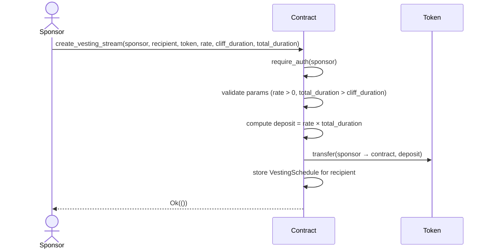
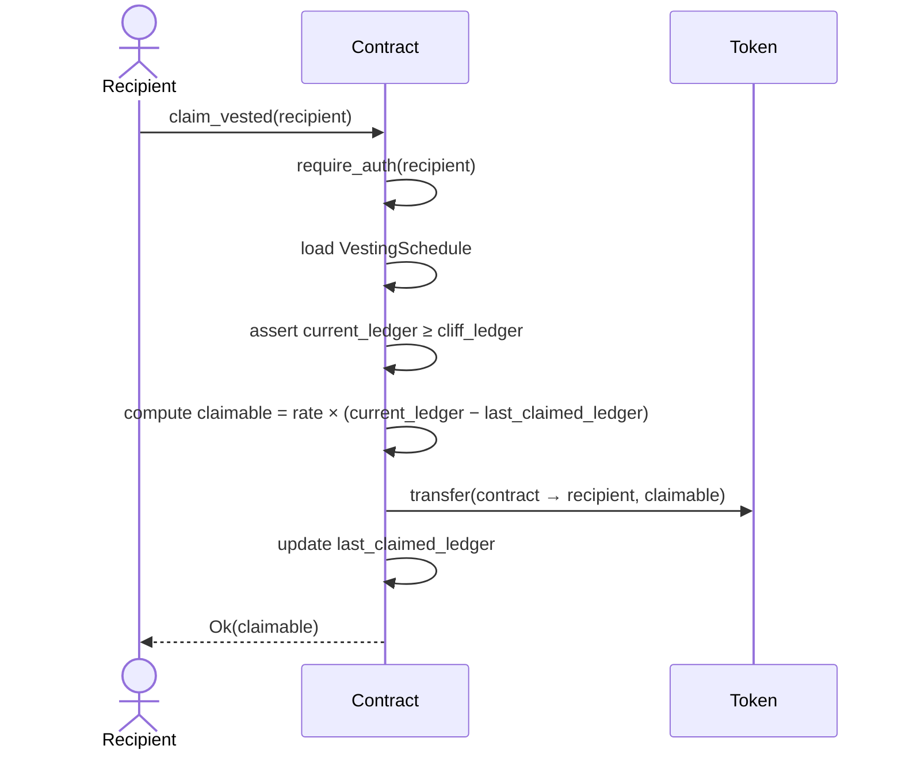
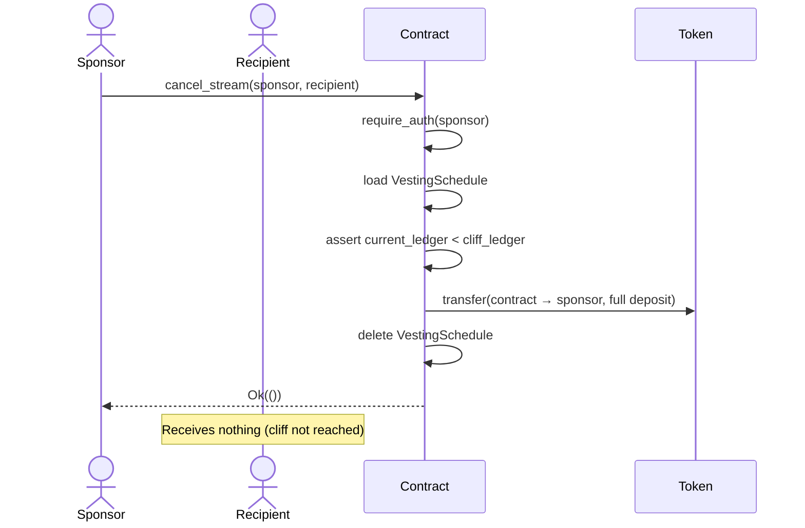
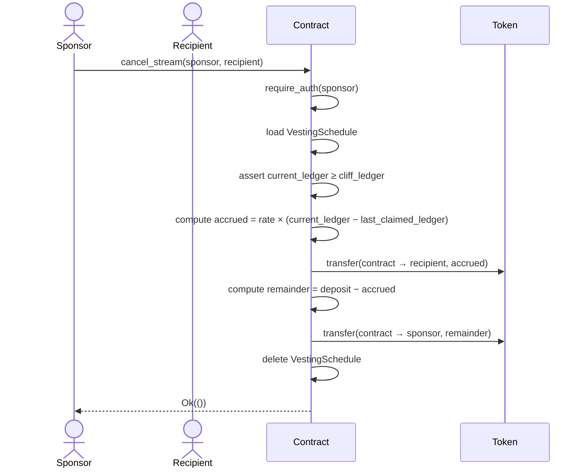
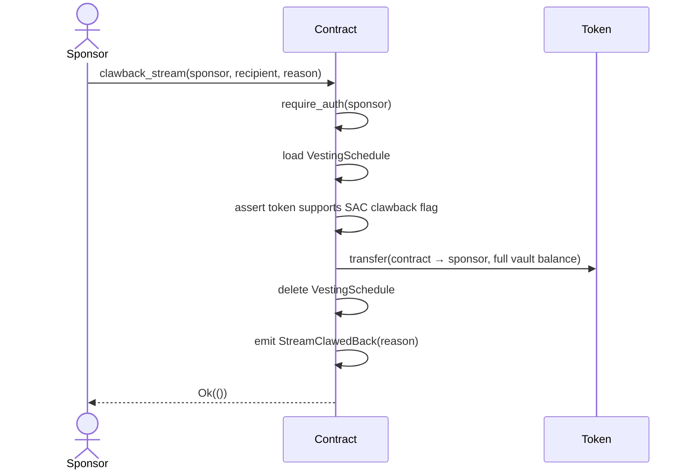
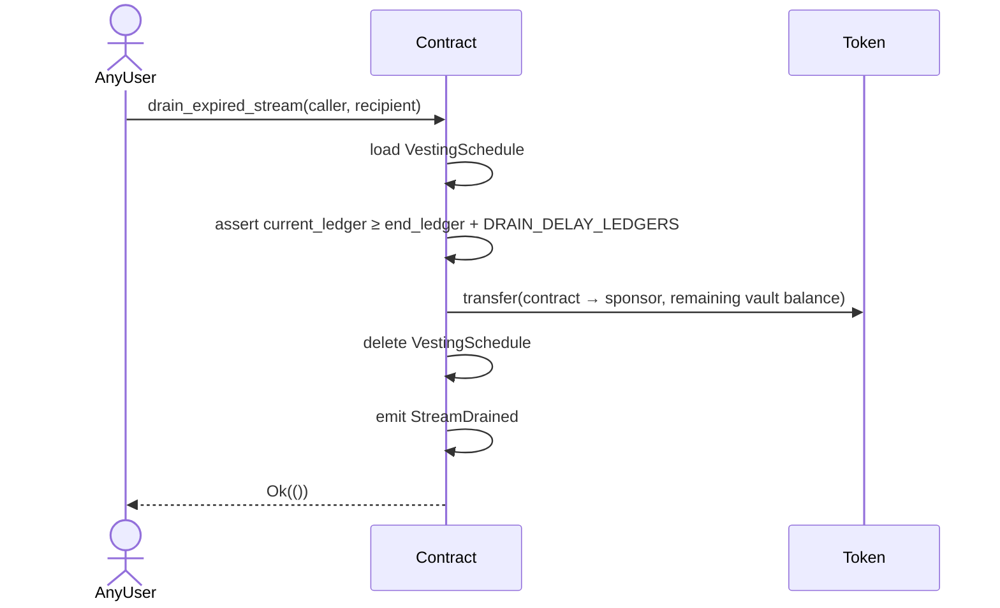

# Contract Flow Diagrams

## 1. Stream Creation

The [sponsor](glossary.md#sponsor) deposits the full [deposit](glossary.md#deposit) (`rate × total_duration`) into the contract [vault](glossary.md#vault) and a [`VestingSchedule`](glossary.md#vestingschedule) is stored in [persistent storage](glossary.md#persistent-storage). If enabled, the recipient must appear in the [allowlist](glossary.md#allowlist) or the transaction is rejected. A [protocol fee](glossary.md#protocol-fee) (if configured) is deducted from the deposit before storage. Creation is idempotent at the on-chain level: a duplicate recipient returns `ScheduleAlreadyExists`. See the [Idempotency Key](glossary.md#idempotency-key) entry for safe retry behaviour in the HTTP API layer.

## 2. Claim After Cliff

The recipient calls `claim_vested` at any point after the [cliff](glossary.md#cliff). On the first call the contract performs a [catch-up claim](glossary.md#catch-up-claim) — a lump-sum transfer of all tokens accrued since `start_ledger`. Subsequent calls collect tokens accrued since the last claim. Any sub-unit remainder ([dust](glossary.md#dust)) stays in the vault until cancellation or drain.

## 3. Cancel Before Cliff

If the [sponsor](glossary.md#sponsor) cancels before the [cliff](glossary.md#cliff), the full remaining [vault](glossary.md#vault) balance is returned to the sponsor and the schedule is deleted. The recipient receives nothing.

## 4. Cancel After Cliff

After the [cliff](glossary.md#cliff), cancellation splits the vault: accrued tokens go to the recipient immediately and the unaccrued remainder returns to the [sponsor](glossary.md#sponsor). Any [dust](glossary.md#dust) from integer-division rounding is included in the remainder.

## 5. Clawback

[Clawback](glossary.md#clawback) is a compliance mechanism available only on SAC tokens that carry the clawback flag. The original [sponsor](glossary.md#sponsor) recovers **all remaining vault tokens** regardless of cliff or accrual state. A mandatory `reason` string is stored on-chain for audit trails. See the [FAQ](faq.md#what-is-clawback-and-when-can-it-be-used) for usage guidance.

## 6. Drain Expired Stream

After a stream's `end_ledger` plus the [drain delay](glossary.md#drain-delay) (~1 year / ~3,153,600 ledgers) has elapsed, this [permissionless](glossary.md#permissionless) function allows **any caller** to return unclaimed tokens to the original sponsor. It exists to prevent indefinite token lockup when a recipient's keys are permanently lost. Any [dust](glossary.md#dust) remaining in the vault is included in the transfer. See the [FAQ](faq.md#what-happens-to-tokens-in-an-expired-stream) for context.

