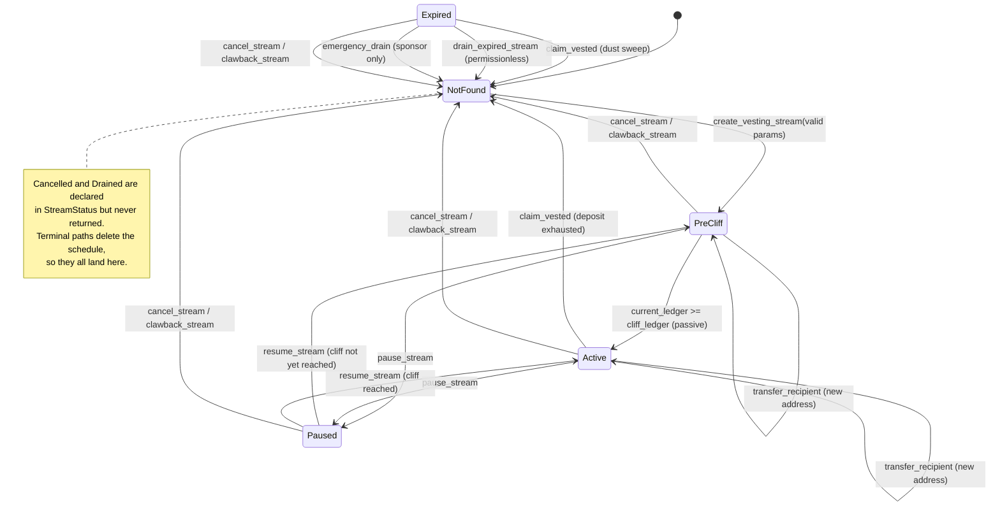
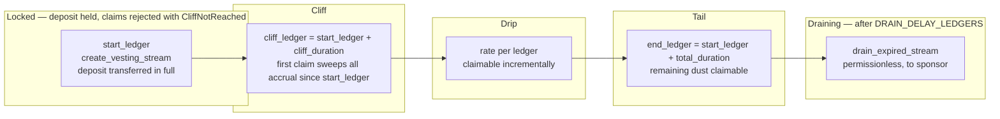
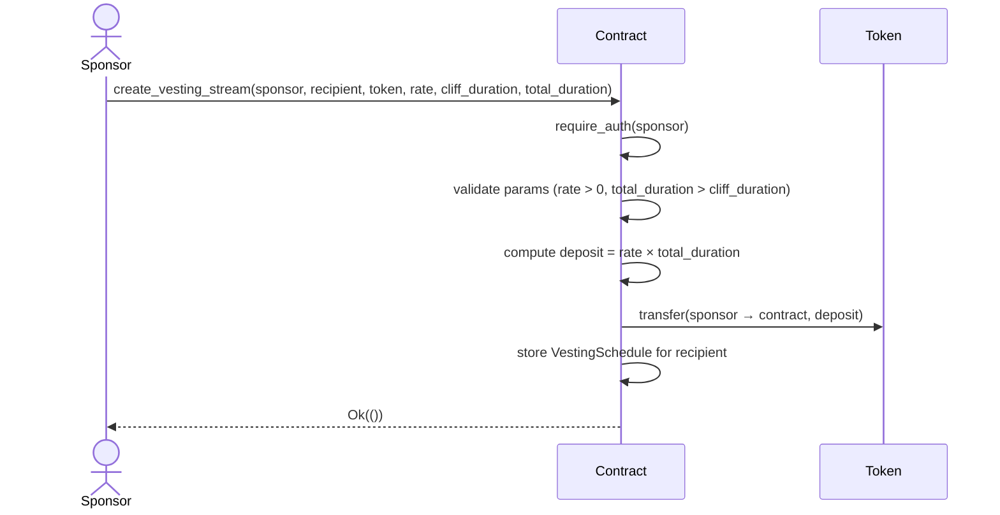
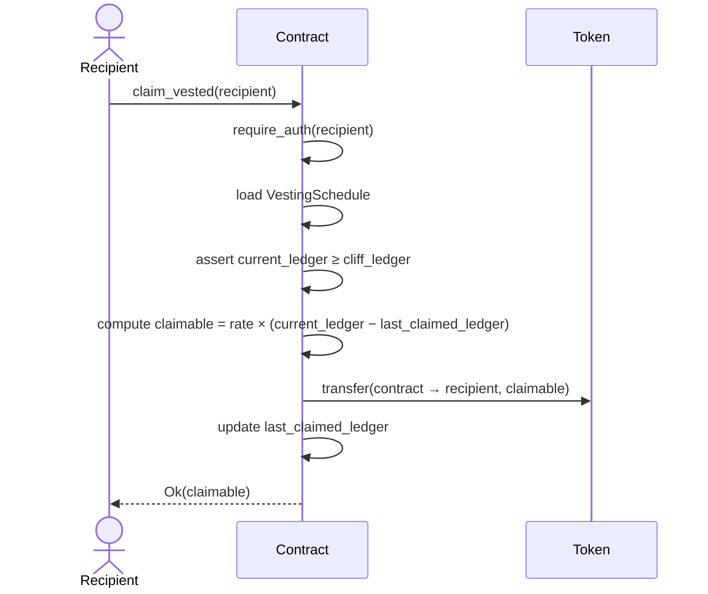
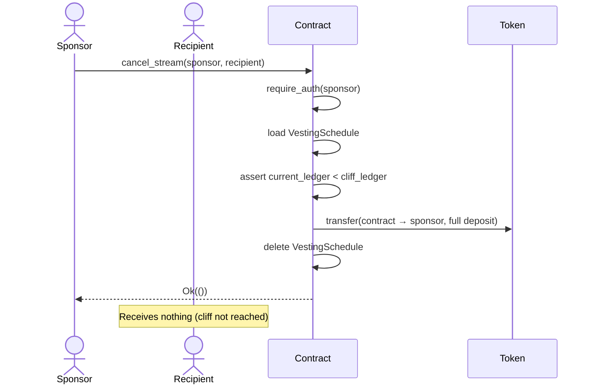
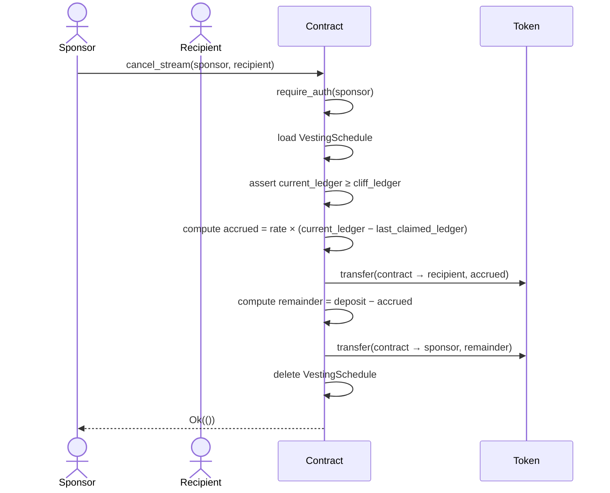
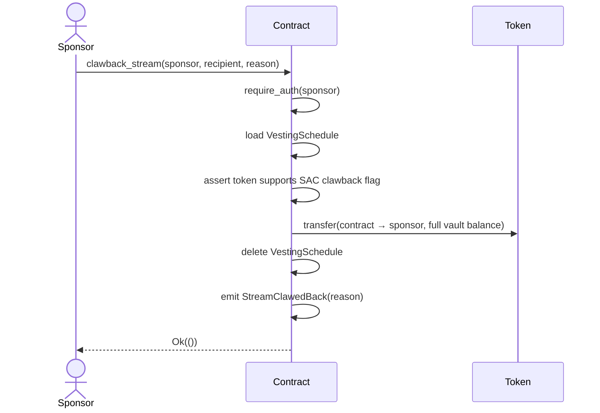
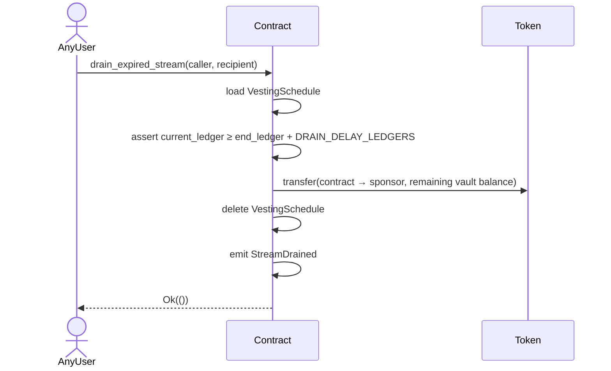

# Contract Flow Diagrams

## Lifecycle State Machine

The vesting stream lifecycle is modelled as a state machine covering creation, cliff progression, claiming, pausing, cancellation, clawback, and draining.

**There is no persisted lifecycle state.** `StreamStatus` is *computed on every read* from three stored facts — `paused_at_ledger`, and the current ledger compared against `cliff_ledger` and `end_ledger`:

```rust
// contract.rs — stream_status()
if no schedule                              -> NotFound
else if paused_at_ledger.is_some()          -> Paused
else if current_ledger < cliff_ledger       -> PreCliff
else if current_ledger < end_ledger         -> Active
else                                        -> Expired
```

Two consequences follow, and both are easy to get wrong when reading the type:

1. **Every terminal path converges on `NotFound`.** `cancel_stream`, `clawback_stream`, `drain_expired_stream`, `emergency_drain`, and the auto-removal in `claim_vested` all delete the schedule. Once any of them runs, the stream is indistinguishable from one that never existed.
2. **`StreamStatus::Cancelled` and `StreamStatus::Drained` are unreachable.** No code path returns either variant. They are declared in the enum but nothing assigns them, so they describe *history* rather than observable state. The diagram below marks them as such rather than drawing transitions that cannot occur.

### Mermaid state diagram


```mermaid
stateDiagram-v2
    [*] --> NotFound

    NotFound --> PreCliff: create_vesting_stream(valid params)

    PreCliff --> Active: current_ledger >= cliff_ledger (passive)
    PreCliff --> Paused: pause_stream
    PreCliff --> NotFound: cancel_stream / clawback_stream
    PreCliff --> PreCliff: transfer_recipient (new address)

    Active --> Active: claim_vested (partial)
    Active --> NotFound: claim_vested (deposit exhausted)
    Active --> Paused: pause_stream
    Active --> NotFound: cancel_stream / clawback_stream
    Active --> Active: transfer_recipient (new address)

    Paused --> PreCliff: resume_stream (cliff not yet reached)
    Paused --> Active: resume_stream (cliff reached)
    Paused --> NotFound: cancel_stream / clawback_stream

    Expired --> NotFound: claim_vested (dust sweep)
    Expired --> NotFound: drain_expired_stream (permissionless)
    Expired --> NotFound: emergency_drain (sponsor only)
    Expired --> NotFound: cancel_stream / clawback_stream

    note right of NotFound
        Cancelled and Drained are declared
        in StreamStatus but never returned.
        Terminal paths delete the schedule,
        so they all land here.
    end note
```

### State definitions

- **NotFound** — no schedule exists for the recipient. Either it was never created, or a lifecycle ended and the entry was removed.
  - Entry conditions: initial state, or any terminal path above.
  - Allowed operations: create a new stream.
- **PreCliff** — a stream exists and `current_ledger < cliff_ledger`.
  - Entry conditions: successful creation (`start_ledger` is the current ledger, so the cliff is always in the future), or `resume_stream` on a stream whose cliff has not passed.
  - Allowed operations: `claim_vested` (rejected with `CliffNotReached`), `pause_stream`, `cancel_stream`, `clawback_stream`, `transfer_recipient`.
  - Exit conditions: ledger advances past the cliff → `Active`; `pause_stream` → `Paused`.
- **Active** — `cliff_ledger <= current_ledger < end_ledger`.
  - Entry conditions: reaching the cliff, or `resume_stream` on a stream already past it.
  - Allowed operations: `claim_vested`, `pause_stream`, `cancel_stream`, `clawback_stream`, `transfer_recipient`.
  - Exit conditions: a claim that consumes the remaining accrual removes the schedule → `NotFound`; reaching `end_ledger` → `Expired`.
- **Paused** — `paused_at_ledger` is set. Takes precedence over the cliff and end checks, so a paused stream reports `Paused` regardless of where it sits relative to either.
  - Entry conditions: `pause_stream`, which verifies the caller is the original sponsor.
  - Allowed operations: `resume_stream`, `cancel_stream`, `clawback_stream`.
  - Blocked: `claim_vested` returns `NothingToClaim` and does **not** transition, because claims during a pause would advance `last_claimed_ledger` and forfeit accrual for the paused window.
  - Exit conditions: `resume_stream`, which shifts **both** `end_ledger` and `cliff_ledger` forward by the paused duration so the stream resumes with its remaining runway intact.
- **Expired** — `current_ledger >= end_ledger`. This is a *ledger-clock* state, not a storage condition: the entry is still present and readable. "Storage entry expires or is lost" is not a transition into this state.
  - Entry conditions: ledger advances past `end_ledger`.
  - Allowed operations: `claim_vested` (sweeps the remaining dust), `drain_expired_stream` / `emergency_drain` once `DRAIN_DELAY_LEDGERS` (3_153_600, ~1 year) has also elapsed, `cancel_stream`, `clawback_stream`.
  - Exit conditions: all of the above remove the schedule → `NotFound`.

### Transition table

| From | Action / condition | To | Notes |
|---|---|---|---|
| NotFound | `create_vesting_stream` with valid params | PreCliff | Stores the schedule; the deposit is transferred in full up front. |
| NotFound | `create_variable_stream` | PreCliff | Stepped-rate variant. |
| PreCliff | `current_ledger >= cliff_ledger` | Active | Passive; no transaction required. |
| PreCliff | `pause_stream` | Paused | Sponsor only. |
| PreCliff | `cancel_stream` | NotFound | Recipient receives nothing; sponsor is refunded. |
| PreCliff | `clawback_stream` | NotFound | Compliance clawback; requires SAC clawback support. |
| PreCliff | `transfer_recipient` | PreCliff | Schedule moves to the new address; the old key is deleted. |
| Active | `claim_vested`, accrual remains | Active | Self-loop; advances `last_claimed_ledger`. |
| Active | `claim_vested`, accrual exhausted | NotFound | Auto-removal plus a `StreamCompleted` event. |
| Active | `pause_stream` | Paused | Sponsor only. |
| Active | `cancel_stream` | NotFound | Recipient keeps what accrued; sponsor receives the remainder. |
| Active | `clawback_stream` | NotFound | Remaining accrual is clawed back to the issuer. |
| Active | `transfer_recipient` | Active | Unchanged schedule, re-keyed to the new recipient. |
| Paused | `resume_stream`, cliff not reached | PreCliff | `end_ledger` and `cliff_ledger` both shift forward. |
| Paused | `resume_stream`, cliff reached | Active | Same shift. |
| Paused | `cancel_stream` | NotFound | |
| Paused | `clawback_stream` | NotFound | |
| Expired | `claim_vested` | NotFound | Returns the full remainder; schedule removed. |
| Expired | `drain_expired_stream` after `DRAIN_DELAY_LEDGERS` | NotFound | Permissionless; any caller may trigger it. |
| Expired | `emergency_drain` after `DRAIN_DELAY_LEDGERS` | NotFound | Sponsor only. Near-duplicate of the above. |
| Expired | `cancel_stream` / `clawback_stream` | NotFound | |
| Cancelled *(unreachable)* | — | — | Variant is declared but never returned. |
| Drained *(unreachable)* | — | — | Variant is declared but never returned. |

### Invalid transitions and error mapping

Codes below are the pinned `u32` values in `error.rs`; see [ADR-0004](adr/0004-error-code-numbering.md). Rows marked **undeclared** reference a variant that `contract.rs` uses but `error.rs` does not define — a compile error tracked in #856.

| Code | Error | Raised when |
|---|---|---|
| 1 | `ScheduleNotFound` | `claim_vested`, `cancel_stream`, `clawback_stream`, or a drain is called with no schedule — i.e. from `NotFound`, or after any terminal path. |
| 2 | `CliffNotReached` | `claim_vested` while `current_ledger < cliff_ledger`. |
| 3 | `InvalidDuration` | Creation with `total_duration <= cliff_duration`. |
| 4 | `InvalidRate` | Creation with `rate <= 0`, `fee_bps > MAX_FEE_BPS`, or a non-positive `min_deposit`. |
| 5 | `DepositOverflow` | Checked arithmetic overflows while computing a deposit or accrual. |
| 6 | `ScheduleAlreadyExists` | Creation for a recipient that already has a schedule, in any state. Also returned by `transfer_recipient` when the target already has one. |
| 7 | `NothingToClaim` | `claim_vested` with zero accrual, or while the stream is `Paused`. |
| 8 | `StreamNotExpired` | A drain is attempted before `end_ledger`. |
| 9 | `TransferFailed` | A `try_transfer` to the recipient or sponsor returns an error. |
| 10 | `DrainDelayNotExpired` | A drain is attempted before `end_ledger + DRAIN_DELAY_LEDGERS`. |
| 11 | `InvalidRecipient` | `sponsor == recipient` at creation, or `transfer_recipient` to the same address. |
| 12 | `InvalidToken` | The token is not a valid Stellar Asset Contract. |
| 20 | `MetadataTooLong` | Schedule metadata exceeds 256 bytes. |
| 21 | `TokenDoesNotSupportClawback` | The SAC does not implement the clawback interface. |
| 22 | `ReasonTooLong` | A `clawback_stream` reason exceeds 256 bytes. |
| — | `NotInitialized` *(undeclared)* | Creation before `initialize` has run. |
| — | `AlreadyInitialized` *(undeclared)* | A second call to `initialize`. |
| — | `Unauthorized` *(undeclared)* | An admin-guarded call from a non-admin. |
| — | `Reentrancy` *(undeclared)* | A reentrancy guard trips on a nested entry. |
| — | `StreamAlreadyPaused` *(undeclared)* | `pause_stream` on an already-paused stream. |
| — | `StreamNotPaused` *(undeclared)* | `resume_stream` on a stream that is not paused. |
| — | `DepositBelowMinimum` *(undeclared)* | Creation below the configured `min_deposit`. |
| — | `InvalidSegments` *(undeclared)* | A variable-rate stream with zero or more than `MAX_SEGMENTS` segments, or non-ascending boundaries. |
| — | `InvalidMilestones` *(undeclared)* | A milestone stream with zero or more than `MAX_MILESTONES` milestones. |
| — | `VersionOverflow` *(undeclared)* | `increment_version` overflows. |

## Ledger timeline

Fixed-rate stream created at `start_ledger`, with `cliff_duration` and `total_duration` both in ledgers. `rate` accrues per ledger and is claimable from the cliff onward, with a full catch-up on the first claim.


```mermaid
gantt
    title Fixed-rate stream — cliff, drip, and end_ledger
    dateFormat X
    axisFormat %s
    section Locked
    Deposit in, nothing claimable      :locked, 0, 100
    section Cliff
    Catch-up sweep on first claim      :catchup, 100, 110
    section Vesting
    Linear drip, claimable             :drip, 110, 280
    section Tail
    Dust claimable by anyone           :dust, 280, 290
    section Draining
    Permissionless drain to sponsor    :drain, 290, 400
```

The same timeline expressed against the contract's own ledgers:


```mermaid
flowchart LR
    subgraph locked["Locked — deposit held, claims rejected with CliffNotReached"]
        A["start_ledger<br/>create_vesting_stream<br/>deposit transferred in full"]
    end
    subgraph cliff["Cliff"]
        B["cliff_ledger = start_ledger + cliff_duration<br/>first claim sweeps all accrual since start_ledger"]
    end
    subgraph drip["Drip"]
        C["rate per ledger<br/>claimable incrementally"]
    end
    subgraph tail["Tail"]
        D["end_ledger = start_ledger + total_duration<br/>remaining dust claimable"]
    end
    subgraph drain["Draining — after DRAIN_DELAY_LEDGERS"]
        E["drain_expired_stream<br/>permissionless, to sponsor"]
    end
    A --> B --> C --> D --> E
```

Two behaviours in that diagram are easy to misread:

- **Catch-up is instant, not linear.** The first claim after the cliff transfers the whole accrual from `start_ledger` in one transfer. Standard Drips has no cliff and therefore no catch-up lump; see [docs/comparison.md](comparison.md).
- **The cliff does not extend the schedule.** `end_ledger` is `start_ledger + total_duration` regardless of `cliff_duration`, so a longer cliff means a shorter claimable window for the same total duration.


## 1. Stream Creation

The [sponsor](glossary.md#sponsor) deposits the full [deposit](glossary.md#deposit) (`rate × total_duration`) into the contract [vault](glossary.md#vault) and a [`VestingSchedule`](glossary.md#vestingschedule) is stored in [persistent storage](glossary.md#persistent-storage). If enabled, the recipient must appear in the [allowlist](glossary.md#allowlist) or the transaction is rejected. A [protocol fee](glossary.md#protocol-fee) (if configured) is deducted from the deposit before storage. Creation is idempotent at the on-chain level: a duplicate recipient returns `ScheduleAlreadyExists`. See the [Idempotency Key](glossary.md#idempotency-key) entry for safe retry behaviour in the HTTP API layer.


```mermaid
sequenceDiagram
    actor Sponsor
    participant Contract
    participant Token

    Sponsor->>Contract: create_vesting_stream(sponsor, recipient, token, rate, cliff_duration, total_duration)
    Contract->>Contract: require_auth(sponsor)
    Contract->>Contract: validate params (rate > 0, total_duration > cliff_duration)
    Contract->>Contract: compute deposit = rate × total_duration
    Contract->>Token: transfer(sponsor → contract, deposit)
    Contract->>Contract: store VestingSchedule for recipient
    Contract-->>Sponsor: Ok(())
```

> **Key concepts:** If an [allowlist](glossary.md#allowlist) is active, the contract validates that `recipient` is a whitelisted address before accepting the stream. The `deposit` is computed as `rate × total_duration`; if a [protocol fee](glossary.md#protocol-fee) is configured it will be deducted per-claim rather than at creation. For [milestone stream](glossary.md#milestone-stream) variants, additional checkpoint parameters are passed here.

## 2. Claim After Cliff

The recipient calls `claim_vested` at any point after the [cliff](glossary.md#cliff). On the first call the contract performs a [catch-up claim](glossary.md#catch-up-claim) — a lump-sum transfer of all tokens accrued since `start_ledger`. Subsequent calls collect tokens accrued since the last claim. Any sub-unit remainder ([dust](glossary.md#dust)) stays in the vault until cancellation or drain.


```mermaid
sequenceDiagram
    actor Recipient
    participant Contract
    participant Token

    Recipient->>Contract: claim_vested(recipient)
    Contract->>Contract: require_auth(recipient)
    Contract->>Contract: load VestingSchedule
    Contract->>Contract: assert current_ledger ≥ cliff_ledger
    Contract->>Contract: compute claimable = rate × (current_ledger − last_claimed_ledger)
    Contract->>Token: transfer(contract → recipient, claimable)
    Contract->>Contract: update last_claimed_ledger
    Contract-->>Recipient: Ok(claimable)
```

> **Key concepts:** The first claim after the cliff triggers the [catch-up claim](glossary.md#catch-up-claim) for all accrued tokens. If a [protocol fee](glossary.md#protocol-fee) is active, `fee_amount = claimable * fee_bps / 10_000` is withheld before transfer; any sub-unit remainder is [dust](glossary.md#dust). When automating claims, use the transaction sequence number as an [idempotency key](glossary.md#idempotency-key) to avoid double-submission on timeouts. For [variable rate](glossary.md#variable-rate) streams the `claimable` formula sums across rate segments.

## 3. Cancel Before Cliff

If the [sponsor](glossary.md#sponsor) cancels before the [cliff](glossary.md#cliff), the full remaining [vault](glossary.md#vault) balance is returned to the sponsor and the schedule is deleted. The recipient receives nothing.


```mermaid
sequenceDiagram
    actor Sponsor
    actor Recipient
    participant Contract
    participant Token

    Sponsor->>Contract: cancel_stream(sponsor, recipient)
    Contract->>Contract: require_auth(sponsor)
    Contract->>Contract: load VestingSchedule
    Contract->>Contract: assert current_ledger < cliff_ledger
    Contract->>Token: transfer(contract → sponsor, full deposit)
    Contract->>Contract: delete VestingSchedule
    Contract-->>Sponsor: Ok(())
    Note over Recipient: Receives nothing (cliff not reached)
```

> **Key concepts:** If an [allowlist](glossary.md#allowlist) was used at creation, cancelling does not modify the allowlist — the recipient slot remains reserved until re-used or removed by the admin. Any [dust](glossary.md#dust) in the vault is included in the full-deposit refund to the sponsor.

## 4. Cancel After Cliff

After the [cliff](glossary.md#cliff), cancellation splits the vault: accrued tokens go to the recipient immediately and the unaccrued remainder returns to the [sponsor](glossary.md#sponsor). Any [dust](glossary.md#dust) from integer-division rounding is included in the remainder.


```mermaid
sequenceDiagram
    actor Sponsor
    actor Recipient
    participant Contract
    participant Token

    Sponsor->>Contract: cancel_stream(sponsor, recipient)
    Contract->>Contract: require_auth(sponsor)
    Contract->>Contract: load VestingSchedule
    Contract->>Contract: assert current_ledger ≥ cliff_ledger
    Contract->>Contract: compute accrued = rate × (current_ledger − last_claimed_ledger)
    Contract->>Token: transfer(contract → recipient, accrued)
    Contract->>Contract: compute remainder = deposit − accrued
    Contract->>Token: transfer(contract → sponsor, remainder)
    Contract->>Contract: delete VestingSchedule
    Contract-->>Sponsor: Ok(())
```

## 5. Clawback

[Clawback](glossary.md#clawback) is a compliance mechanism available only on SAC tokens that carry the clawback flag. The original [sponsor](glossary.md#sponsor) recovers **all remaining vault tokens** regardless of cliff or accrual state. A mandatory `reason` string is stored on-chain for audit trails. See the [FAQ](faq.md#what-is-clawback-and-when-can-it-be-used) for usage guidance.


```mermaid
sequenceDiagram
    actor Sponsor
    participant Contract
    participant Token

    Sponsor->>Contract: clawback_stream(sponsor, recipient, reason)
    Contract->>Contract: require_auth(sponsor)
    Contract->>Contract: load VestingSchedule
    Contract->>Contract: assert token supports SAC clawback flag
    Contract->>Token: transfer(contract → sponsor, full vault balance)
    Contract->>Contract: delete VestingSchedule
    Contract->>Contract: emit StreamClawedBack(reason)
    Contract-->>Sponsor: Ok(())
```

## 6. Drain Expired Stream

After a stream's `end_ledger` plus the [drain delay](glossary.md#drain-delay) (~1 year / ~3,153,600 ledgers) has elapsed, this [permissionless](glossary.md#permissionless) function allows **any caller** to return unclaimed tokens to the original sponsor. It exists to prevent indefinite token lockup when a recipient's keys are permanently lost. Any [dust](glossary.md#dust) remaining in the vault is included in the transfer. See the [FAQ](faq.md#what-happens-to-tokens-in-an-expired-stream) for context.


```mermaid
sequenceDiagram
    actor AnyUser
    participant Contract
    participant Token

    AnyUser->>Contract: drain_expired_stream(caller, recipient)
    Contract->>Contract: load VestingSchedule
    Contract->>Contract: assert current_ledger ≥ end_ledger + DRAIN_DELAY_LEDGERS
    Contract->>Token: transfer(contract → sponsor, remaining vault balance)
    Contract->>Contract: delete VestingSchedule
    Contract->>Contract: emit StreamDrained
    Contract-->>AnyUser: Ok(())
```
