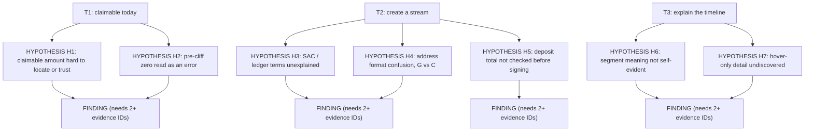

# Affinity Diagram Template — Issue #818

**Issue:** [#818](https://github.com/AlienScroll78/vesting-cliff-drip-stream/issues/818)
**Status:** Empty template. It contains **no observations**. Every node below is a candidate theme, that is a *hypothesis* to be tested in the planned sessions — not a finding, and not evidence that the problem occurs.
**Related:** [`issue-818-research-plan.md`](./issue-818-research-plan.md) §8 · [`issue-818-registers.md`](./issue-818-registers.md)

## 1. Rules

1. A node is a **hypothesis** until it is linked to at least two evidence IDs from different sessions in [`issue-818-registers.md`](./issue-818-registers.md). One observation is a signal, not a theme.
2. A hypothesis promoted to a **finding** is logged in §5 with the evidence IDs, the participants, and the two coders who agreed.
3. Never move a note between hypothesis and finding without writing the evidence IDs in the promotion log. A theme with no evidence IDs stays a hypothesis, however plausible it looks.
4. Quotes are verbatim and attributed to a slot ID (P1–P8) and an evidence ID. No names, no wallet addresses.
5. The repository's existing reports ([`heuristic-evaluation.md`](./heuristic-evaluation.md), [`findings-report.md`](./findings-report.md)) are used only as **seeds** for the themes below. They are prior claims from earlier work, not #818 evidence — see [`issue-818-traceability.md`](./issue-818-traceability.md) §3.

## 2. Diagram skeleton

Dashed rendering in the real diagram should distinguish hypotheses (outline) from findings (filled). Until sessions exist, every `F*` node stays empty.

## 3. Theme table

| Theme ID | Candidate theme (hypothesis) | Seeded from | Task | Evidence IDs | Distinct participants | Max severity | Status |
|----------|------------------------------|-------------|------|--------------|----------------------|---------------|--------|
| H1 | Claimable amount is hard to locate or not trusted as a live number | [`findings-report.md`](./findings-report.md) §Issue 2 theme, [`heuristic-evaluation.md`](./heuristic-evaluation.md) H6-1 | T1 | none | 0 | not observed | hypothesis |
| H2 | A pre-cliff zero is read as a failure rather than a locked state | [`findings-report.md`](./findings-report.md) §Issue 1 | T1 | none | 0 | not observed | hypothesis |
| H3 | SAC and ledger terminology is unexplained at the point of entry | [`findings-report.md`](./findings-report.md) §Issues 2–3, [`heuristic-evaluation.md`](./heuristic-evaluation.md) H2-1/H2-2 | T2 | none | 0 | not observed | hypothesis |
| H4 | `G…` versus `C…` address confusion in the token field | [`findings-report.md`](./findings-report.md) §Issue 3, [`heuristic-evaluation.md`](./heuristic-evaluation.md) H5-3 | T2 | none | 0 | not observed | hypothesis |
| H5 | The deposit total is not verified before signing | [`heuristic-evaluation.md`](./heuristic-evaluation.md) H6-2, [`action-plan.md`](./action-plan.md) | T2 | none | 0 | not observed | hypothesis |
| H6 | The three timeline regions are not self-evident | [`usability-study-1.md`](./usability-study-1.md) task S3, [`heuristic-evaluation.md`](./heuristic-evaluation.md) H6-3 | T3 | none | 0 | not observed | hypothesis |
| H7 | Detail available only on hover or behind an expand is not discovered | [`heuristic-evaluation.md`](./heuristic-evaluation.md) H6-3/H8-1 | T3 | none | 0 | not observed | hypothesis |

## 4. Observation capture during mapping

One row per observation, not per theme. Add rows as sessions are analysed.

| Obs ID | Evidence ID | Slot | Task | Verbatim quote | What the participant did | Facilitator intervention? | Severity (1–4) | Mapped to theme |
|--------|-------------|------|------|----------------|--------------------------|--------------------------|----------------|----------------|
| OBS-001 | PLACEHOLDER | PLACEHOLDER | PLACEHOLDER | PLACEHOLDER | PLACEHOLDER | PLACEHOLDER | PLACEHOLDER | PLACEHOLDER |

## 5. Promotion log

| Theme ID | Promoted to finding on | Evidence IDs relied on | Participants | Coder 1 | Coder 2 | Disagreement noted |
|----------|------------------------|------------------------|--------------|---------|---------|--------------------|
| — | — | — | — | — | — | — |

## 6. Cohort split

Affinity mapping is also run per cohort (P1–P4 technical, P5–P8 non-technical). A theme that appears in only one cohort is reported as a cohort-specific finding, not a general one, even when its overall count is high. The `Distinct participants` column in §3 is filled from the full set; add a second column per cohort when the mapping is complete.
