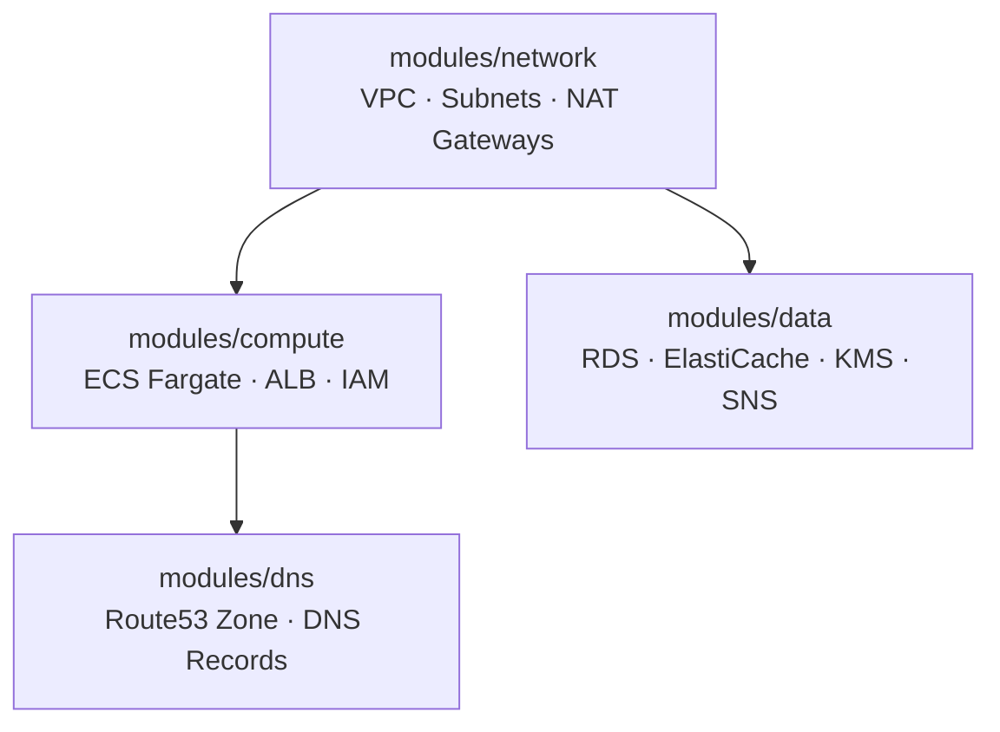

# Terraform — Vesting Cliff Drip Stream

This directory contains the Terraform configuration for provisioning all cloud
infrastructure required by the vesting application.

## Architecture

```
                    ┌─────────────────────────────┐
                    │     Route53 (DNS)            │
                    │  api.vesting.example.com      │
                    └──────────┬──────────────────┘
                               │
                    ┌──────────▼──────────────────┐
                    │   ALB (Application LB)       │
                    └──────────┬──────────────────┘
                               │
              ┌────────────────┼────────────────┐
              │                │                │
    ┌─────────▼──────┐  ┌─────▼──────┐  ┌──────▼─────────┐
    │  ECS Fargate   │  │  RDS       │  │  ElastiCache    │
    │  (backend API) │  │  PostgreSQL│  │  Redis          │
    └────────────────┘  └────────────┘  └─────────────────┘
```

## Module Dependency Diagram



`network` must be applied first — `compute` and `data` both consume its VPC and subnet outputs. `dns` requires the ALB DNS name and zone ID from `compute`.

## Modules

| Module | Description | Resources | README |
|--------|-------------|-----------|--------|
| [`network`](modules/network/README.md) | VPC, subnets, NAT gateways, route tables, internet gateway | 10+ | [→](modules/network/README.md) |
| [`compute`](modules/compute/README.md) | ECS cluster, Fargate task definition, service, ALB, IAM | 8 | [→](modules/compute/README.md) |
| [`data`](modules/data/README.md) | RDS PostgreSQL, ElastiCache Redis, KMS, SNS backup alerts | 10+ | [→](modules/data/README.md) |
| [`dns`](modules/dns/README.md) | Route53 hosted zone, A/CNAME records for API and app | 3+ | [→](modules/dns/README.md) |
| `secrets` | AWS Secrets Manager secrets, rotation Lambda, KMS, CloudTrail audit | 25+ | — |

## Environments

| Environment | Variables file | Domain | RDS class | Monthly budget |
|-------------|---------------|--------|-----------|---------------|
| staging | `envs/staging.tfvars` | `staging.vesting.example.com` | `db.t3.micro` | $500 |
| production | `envs/production.tfvars` | `vesting.example.com` | `db.t3.small` | $500 |

## Prerequisites

- Terraform >= 1.6, < 2.0
- AWS CLI v2 with credentials that may create the state bucket and lock table (bootstrap only)
- Remote state bootstrapped per environment with `terraform/bootstrap/init.sh` (see
  [docs/runbooks/terraform-bootstrap.md](../docs/runbooks/terraform-bootstrap.md))

## Backend layout

Every environment has its own bucket, state key, and lock table. The backend block in `main.tf` is
partial; the values come from the per-environment file passed to `terraform init`.

| Environment | State bucket | State key | Lock table | Backend config |
|-------------|--------------|-----------|------------|----------------|
| staging | `vestingdrips-terraform-state-staging` | `staging/terraform.tfstate` | `vestingdrips-terraform-locks-staging` | `envs/staging.backend.hcl` |
| production | `vestingdrips-terraform-state-production` | `production/terraform.tfstate` | `vestingdrips-terraform-locks-production` | `envs/production.backend.hcl` |

## Bootstrap (first-time setup, once per environment)

```bash
cd bootstrap

# 1. Plan the state bucket and lock table (nothing is created without --apply).
./init.sh staging

# 2. Apply the reviewed plan, then verify encryption, versioning, access block and lock table.
./init.sh staging --apply

# 3. Optionally enable MFA delete on the state bucket (interactive; requires a fresh MFA code).
BOOTSTRAP_MFA_SERIAL='arn:aws:iam::<ACCOUNT_ID>:mfa/<USER_NAME>' ./init.sh staging --enable-mfa-delete

# 4. Point this root module at the new backend.
./init.sh staging --backend-only
```

Repeat for `production`. Migration from an older backend, stale-lock handling, state recovery and MFA
delete are documented in [docs/runbooks/terraform-bootstrap.md](../docs/runbooks/terraform-bootstrap.md).

## Usage

Each environment needs its own `TF_DATA_DIR` so two backend configurations never share a working
directory. `init.sh` sets this automatically.

```bash
# Staging
export TF_DATA_DIR="$PWD/.terraform/staging"
terraform init -input=false -backend-config=envs/staging.backend.hcl
terraform plan -lock-timeout=5m -var-file=envs/staging.tfvars \
  -var="db_password=$(aws secretsmanager get-secret-value --secret-id vesting/staging/db-password --query SecretString --output text)"
terraform apply -lock-timeout=5m -var-file=envs/staging.tfvars \
  -var="db_password=$(...)"

# Production
export TF_DATA_DIR="$PWD/.terraform/production"
terraform init -input=false -backend-config=envs/production.backend.hcl
terraform plan -lock-timeout=5m -var-file=envs/production.tfvars \
  -var="db_password=$(aws secretsmanager get-secret-value --secret-id vesting/production/db-password --query SecretString --output text)"
terraform apply -lock-timeout=5m -var-file=envs/production.tfvars \
  -var="db_password=$(...)"
```

There are no Terraform workspaces: the environment is selected by the backend file and the tfvars
file, and `var.environment` rejects any value other than `staging` or `production`.
No secret is passed on the command line. The database password is generated by
Terraform, and every other secret is applied once and then owned by AWS Secrets
Manager.

```bash
# Staging
terraform workspace new staging 2>/dev/null || true
terraform workspace select staging
terraform plan -var-file="envs/staging.tfvars" \
  -var="slack_webhook_url=$SLACK_WEBHOOK_URL" \
  -var='cost_alert_emails=["ops@example.com"]'
terraform apply -var-file="envs/staging.tfvars" ...

# Production
terraform workspace new production 2>/dev/null || true
terraform workspace select production
terraform plan -var-file="envs/production.tfvars" \
  -var="slack_webhook_url=$SLACK_WEBHOOK_URL" \
  -var='cost_alert_emails=["ops@example.com"]'
terraform apply -var-file="envs/production.tfvars" ...
```

See [docs/runbooks/secrets-management.md](../docs/runbooks/secrets-management.md)
for the secret inventory, rotation procedure and audit queries.

## CI/CD

- **Pull requests**: `terraform plan` runs automatically. The plan output is
  posted as a PR comment (see `.github/workflows/ci.yml`).
- **Apply to staging**: Automatic on merge to `main` via
  `.github/workflows/staging.yml`.
- **Apply to production**: Manual approval required. Triggered via
  `workflow_dispatch`.

## State Management

| Component | Location | Notes |
|-----------|----------|-------|
| S3 bucket (staging) | `vestingdrips-terraform-state-staging` | AES-256, versioning, public access blocked, ownership controls, lifecycle keeps the latest 30 noncurrent versions |
| S3 bucket (production) | `vestingdrips-terraform-state-production` | Same controls; MFA delete enabled out-of-band |
| DynamoDB table (staging) | `vestingdrips-terraform-locks-staging` | Pay-per-request, `LockID` hash key |
| DynamoDB table (production) | `vestingdrips-terraform-locks-production` | Same; required by the drift-detection role |
| State key | `staging/terraform.tfstate`, `production/terraform.tfstate` | One key per environment, no workspaces |
| Bootstrap state | `bootstrap/.terraform/<env>/terraform.tfstate` | Local by design; back it up, never commit it |

## Provider Versions

| Provider | Version | Notes |
|----------|---------|-------|
| hashicorp/aws | ~> 5.80 | Pinned to prevent breaking changes |
| hashicorp/random | ~> 3.6 | Database bootstrap password and placeholder secrets |
| hashicorp/tls | ~> 4.0 | Generates the bootstrap RS256 signing key |

## Security

- Secrets are stored in AWS Secrets Manager and delivered to ECS through the
  task definition `secrets` field, never as plain environment variables
- The ECS task execution role is scoped to only the four secrets it receives,
  replacing the account-wide `AmazonECSTaskExecutionRolePolicy`
- The database password rotates automatically every 30 days in place, with no
  downtime; rotation failures alarm to SNS
- CloudTrail records every read of a `vesting/{env}/*` secret
- All secrets are encrypted with a customer-managed KMS key with rotation on
- RDS storage is encrypted with a customer-managed KMS key
- RDS deletion protection is enabled
- State buckets use AES-256 encryption, block all public access, enforce
  bucket-owner ownership, and keep versioned history
- State buckets use MFA delete, enabled interactively by an operator
  (`bootstrap/init.sh --enable-mfa-delete`); no MFA code is ever stored
  in code, CI, or documentation. See
  [docs/runbooks/terraform-bootstrap.md](../docs/runbooks/terraform-bootstrap.md)

## Estimated Monthly Cost

| Service | Configuration | Staging | Production |
|---------|--------------|---------|------------|
| ECS Fargate | backend 256 CPU / 512 MB on on-demand | ~$10 | ~$35 (3 tasks) |
| ECS Fargate Spot | indexer 512 CPU / 1024 MB, ~60-70% discount | ~$4 | ~$12 |
| ALB | 1 LB, idle timeout 60s | ~$22 | ~$22 |
| RDS PostgreSQL | db.t3.micro (stg) / db.t3.small (prod), 20GB gp2 | ~$17 | ~$35 |
| ElastiCache Redis | cache.t3.micro, 1 node | ~$14 | ~$28 (cache.t3.small, 2 nodes) |
| NAT Gateway | 2 AZ | ~$64 | ~$64 |
| VPC endpoints | S3 gateway only (free) | ~$0 | ~$0 |
| Route53 | 1 hosted zone + 3 records | ~$1 | ~$1 |
| S3 (state + audit) | Versioning enabled | ~$2 | ~$3 |
| CloudWatch Logs | Container + RDS + audit logs | ~$5 | ~$15 |
| KMS | 1 customer key | ~$1 | ~$1 |
| **Total** | | **~$141/mo** | **~$221/mo** |

> Costs are estimates for us-east-1 as of July 2026. Actual costs may vary
> based on data transfer, storage consumption, and request volume.
>
> The S3 gateway endpoint is free and removes the highest-volume NAT traffic.
> Interface endpoints are opt-in (`interface_endpoint_services`) because at
> ~$7.20 per AZ per month they cost more than the NAT traffic they avoid at
> current volume. See the cost optimization section of
> [docs/runbooks/cost-monitoring.md](../docs/runbooks/cost-monitoring.md).
>
> A pull request that changes this directory gets an Infracost cost comment
> showing the delta, so the effect of a change is visible before it merges.
